# madosho

madosho is a composable, document-centric RAG platform. It is three things in
one codebase: a **kernel library** for building queryable corpora from documents
(PDF, office, web, and more), a
**service platform** (control plane on :8000 + query plane on :8001 + a
background worker), and a **web workbench** for managing documents and tuning
retrieval pipelines. The focus is the storage and retrieval side of RAG.

**Why:** what is the best way to do RAG? The honest answer is "it depends" - on
the documents, the questions, and the tools. madosho is built to let you find
out instead of guessing: make any technique a component (docling vs pypdfium2,
one chunker vs another, this embedder vs that one), build it into a named
pipeline, and compare the pipelines side by side on your own documents. Every
built pipeline keeps its index and stays queryable; comparison is the product,
not an afterthought.

**Agents:** RAG is useful, and RAG used by agents is more useful. madosho is
backend-first (backend-only if you want; the frontend is there to visualize the
RAG process and organize documents). Agents drive it directly via `madosho-cli`
and MCP, or through the bundled portable skills for Claude Code, Codex, and
opencode. Four external interfaces expose the same retrieval core: the native
HTTP API + OpenAI shim, chat frontends (Open WebUI), the CLI + agent skills,
and an MCP server. See "External interfaces" below, or jump straight to
`examples/demo/README.md` for the full demo trail.

Comparison is the product: a single document carries multiple named pipelines -
each a full `extract -> chunk -> index` build with its own stored index and its
own per-step rating - all live and queryable at once.

## Status

Runs via Docker Compose on any machine that has Docker - a laptop, a home
server, a cloud VM. Clients do not have to sit on the same machine as the
stack: every interface takes the stack's address by env var or config (see
`docs/HEADLESS.md`, "Reach the stack from another machine"). Licensed under
Apache-2.0. API-key / user auth is built in and on by default. Not yet packaged
for PyPI and not production-hardened. Use it to explore, benchmark, and tune
retrieval pipelines.

Where the pieces run, and how clients reach them:

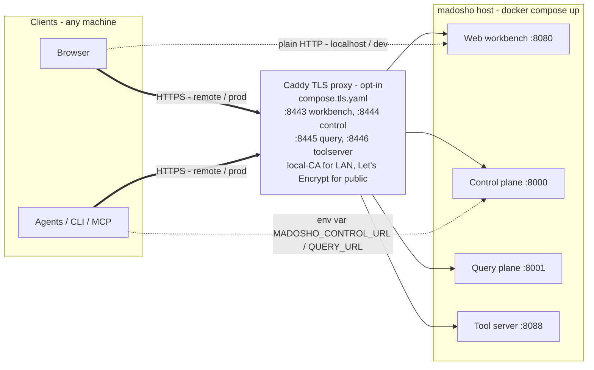

## Quickstart (service + web workbench)

```bash
git clone https://github.com/hogu-dev/madosho.git && cd madosho
cp .env.example .env
docker compose up
```

Auth is on by default. The example `.env` seeds a first login of
**admin / admin**, so once the stack is up, open the workbench at
`http://localhost:8080`, log in, and **change the password immediately** on the
Users page (use the reset button on your own row). Prefer your own credentials?
Set `MADOSHO_BOOTSTRAP_ADMIN_USER` / `MADOSHO_BOOTSTRAP_ADMIN_PASSWORD` in
`.env` before the first `up`, or create the account once the stack is running:

```bash
docker compose exec app python -m madosho_server.users_cli create --name admin --scope admin
# prompts for a password
```

Running the stack on a remote box (a home server, a cloud VM)? Start it with the TLS
overlay instead and open `https://madosho-host:8443` - see
`examples/tls/README.md`. (Dev-only alternative: plain HTTP at
`http://madosho-host:8080` with `MADOSHO_COOKIE_INSECURE=1` in `.env`, because
the login cookie is Secure-only by default and browsers drop it over plain
HTTP from any address except localhost - see `docs/AUTH.md`.) Upload a PDF,
watch it index through the default pipeline, build extra pipelines with
different tools from the DocumentDetail page, and compare them side by side.
The Scrying tab lets you ask questions and see the retrieved chunks and the
assembled prompt.

Indexing, search, and compare all work out of the box. Generated answers (the
Scrying answer, research reports, the contextual chunker) are **off until you
wire an LLM**: set `MADOSHO_LLM_API_BASE` in `.env` to any OpenAI-compatible
endpoint - a bundled `services/llm-endpoint` / `services/agent-server`, your own
GPU box, or a hosted provider. It is blank by default; see `.env.example`.

Beyond the env default, named endpoints are registered on the Settings page
(or `POST /llm-endpoints`): provider, model, API base, a key env var, text and
vision capability flags, and an **API flavor** - `chat` (standard
chat-completions, the default) or `responses` (the OpenAI Responses API).
The `responses` flavor is what subscription relays and local proxy servers
typically speak: join the proxy to the compose network (or publish it on a
host port), register it with API base `http://your-proxy:PORT/v1` and flavor
`responses`, and point the key env var at any placeholder value if the proxy
handles authentication itself - the client insists a key exists, the proxy
ignores it. An endpoint flagged `vision` can also transcribe scanned pages
for the `vision` parser.

The service uses **per-pipeline Qdrant collections** - each named pipeline has
its own stored index. All are live at once and queryable. "Selecting" a
pipeline for a document just chooses which one answers queries by default;
nothing rebuilds.

For headless / API / agent access you will also want an API key:

```bash
docker compose exec app python -m madosho_server.keys_cli create --name me --scope write
export MADOSHO_API_KEY=<the key it prints>    # printed once
```

See `docs/AUTH.md` for scopes, browser login, and user accounts. Both humans and
agents authenticate into the same scope gate that guards both planes:

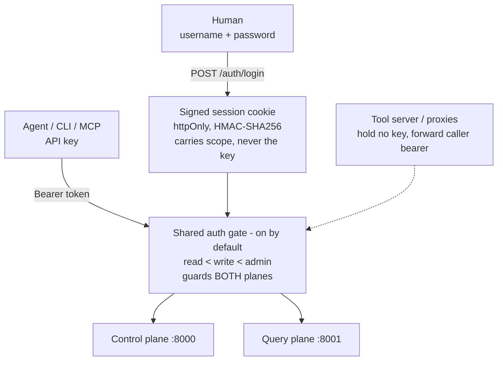

## Use it as a library

Write a `madosho.yaml` next to your data:

```yaml
corpus: contracts
source: ./pdfs

ingest:
  parser: router
  chunker: docling-hybrid
  embedder: granite-embedding-english-r2
  store: lancedb
  indexes: [bm25, dense]

query:
  - keyword_search: {k: 50}
  - semantic_search: {k: 50}
  - fuse: {method: rrf}
  - rerank: {model: granite-reranker-english-r2, top_k: 8}
```

Then ingest and query (`--config path/to/madosho.yaml` if you are not in the
same directory):

```console
$ madosho ingest
processed: 2  skipped: 0  failed: 0  (2.5s)

$ madosho query "What does the termination clause require?"
[1] ./pdfs/contract_a.pdf p.1  (score 0.910, via rerank)
    ... The termination clause requires ninety days written notice ...
```

Or as a Python library:

```python
import madosho

corpus = madosho.open("madosho.yaml")
corpus.ingest()                # idempotent: unchanged files are skipped by content hash
for hit in corpus.query("What does the termination clause require?"):
    print(hit.citation, hit.score, hit.text)
```

Where things live:

- A relative `source:` resolves against the **config file's directory**, never
  the process cwd.
- Corpus state (LanceDB tables, ingest manifest) lives in `.madosho/` next to
  the config file.
- Models download once into the standard Hugging Face cache
  (`~/.cache/huggingface`), shared across projects.

### Using a Qdrant server instead

Swap the store in `madosho.yaml` to point at a running Qdrant
(`docker run -p 6333:6333 qdrant/qdrant`):

```yaml
ingest:
  store:
    qdrant:
      url: http://localhost:6333
```

Server API keys are read from the `QDRANT_API_KEY` env var (configurable via
the `api_key_env` option) -- never placed in the config file. Unlike the
LanceDB store, the Qdrant store preserves all chunk-metadata keys and exposes
multi-vector/MaxSim retrieval through the `MultiVectorSearch` extension.

## External interfaces

Four doors, each covering a different consumer:

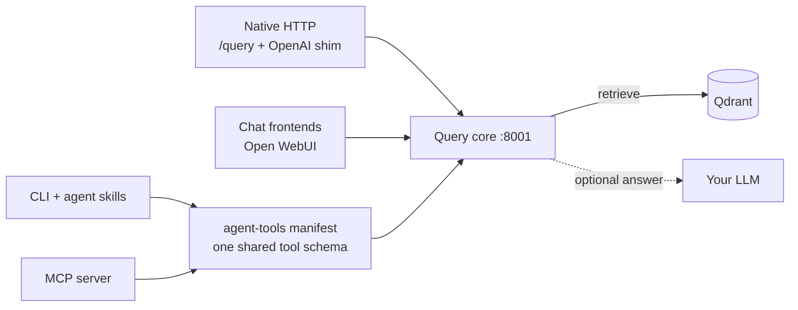

| Door | What it is | Guide |
|------|------------|-------|
| Native HTTP + OpenAI shim | `/query` (cited chunks, or a proxied answer) + `/v1/chat/completions` shim on :8001 | `examples/api-contract/README.md` |
| Chat frontends | Open WebUI via the shim (proxy) or via the OpenAPI tool server on :8088 (context source) | `examples/chat-frontends/README.md` |
| CLI + agent skills | `madosho-cli` + two portable `SKILL.md` skills you copy into any project | `skills/README.md` |
| MCP server | `madosho-mcp` (stdio default, `--http` optional) for Claude Desktop, Cursor, IDE agents | `examples/mcp/README.md` |

All four share the same tool schemas, derived from the one `agent-tools`
manifest (`madosho_cli/manifest.py`) -- they cannot drift from each other.

Here is an agent (Claude Code) answering over a corpus through the MCP `search`
tool: the retrieval and citations come from madosho, the reasoning from the agent.

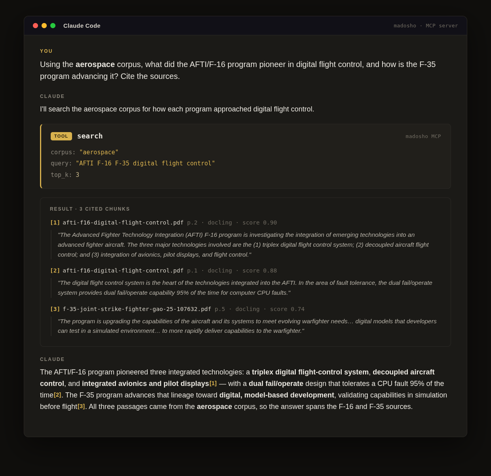

The chat-frontends door wires up two ways -- Mode A where madosho produces the
answer, Mode B where your own chat model does and madosho is just a retrieval
tool:

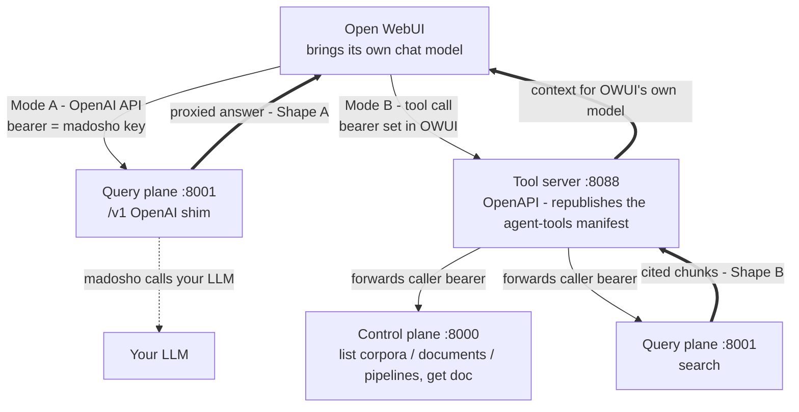

To run all four headless demos in sequence: `python examples/demo/demo_all.py`.

Full demo trail: `examples/demo/README.md`. Headless write access (create
corpora, upload, build pipelines over HTTP): `docs/HEADLESS.md`.

## Install

madosho ships as three PyPI packages so you install only what you need:

| Package | `pip install ...` | Use it when you want to... |
|---|---|---|
| **madosho-cli** | `madosho-cli` | drive a running madosho from the shell or an agent (zero dependencies) |
| **madosho-mcp** | `madosho-mcp` | expose a madosho corpus to an MCP host (Claude Desktop, IDEs, agents) |
| **madosho** | `madosho[server]` | run the full server/framework yourself |

`madosho-cli` and `madosho-mcp` are lightweight HTTP clients - no server, no Postgres,
no model stack. The server package pulls `madosho-cli` in automatically.

To run the full server or develop from source (Python >= 3.11):

```bash
pip install ./packaging/madosho-cli   # the client dep; only a 0.0.1 placeholder is on PyPI so far
pip install -e ".[local]"
```

The `local` extra pulls the full default stack. Extras are independent --
install only what your pipeline uses:

| Extra | Pulls | Used by |
|-------|-------|---------|
| `docling` | docling (layout + TableFormer), pypdfium2, onnxruntime | `router`, `docling`, `pypdfium2` parsers, `docling-hybrid` chunker; onnxruntime powers the `rapidocr` OCR engine |
| `ocr-easyocr` | easyocr | the `easyocr` OCR engine (opt-in; see `compose.ocr.yaml`) |
| `models` | sentence-transformers | granite embedder and reranker |
| `lancedb` | lancedb, pyarrow | `lancedb` store |
| `qdrant` | qdrant-client | `qdrant` store (server; in-process local mode for tests) |
| `server` | fastapi, uvicorn, sqlalchemy, psycopg, procrastinate, any-llm-sdk, python-multipart | the service platform (control + query planes + worker) |
| `research` | any-llm-sdk | the standalone `research_agent` package |
| `local` | all of `docling`, `lancedb`, `models` | the default library pipeline |
| `dev` | pytest, fpdf2, build, packaging, testcontainers, httpx, openai | running the test suite |

Core itself depends only on `pydantic` and `pyyaml`. Dependency floors are
**tested floors** -- the suite runs against every declared minimum (enforced by
`tests/unit/test_scaffold.py`).

> **Dev layout:** `madosho_cli/` and `madosho_mcp/` stay at the repo root; their
> standalone PyPI build configs live under `packaging/`. The test suite imports every
> package straight from the source tree (`pythonpath` in `pyproject.toml`), so a plain
> `pytest` run needs no editable install of the split-out clients.

## How it works

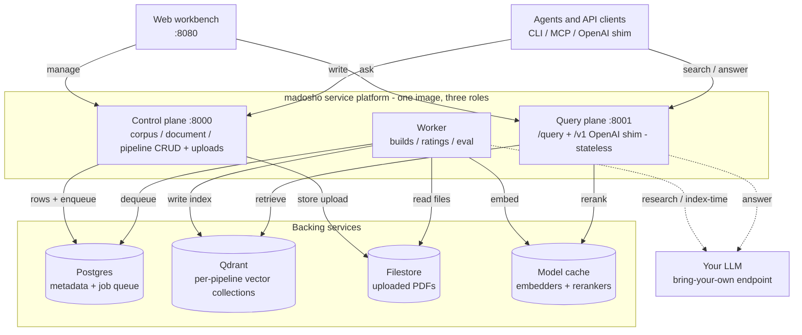

A **Corpus** is source documents + a default recipe + the indexes built from them.

**Ingest** is fixed slots: `parser -> chunker -> embedder -> store`, plus which
indexes to build (`bm25`, `dense`). In the library path the store is LanceDB
(local, no server). In the service path the worker builds **per-pipeline
Qdrant collections** -- each named pipeline gets its own collection that stays
live independently.

**Query** is a composable operator stack, run top to bottom. Search operators
(`keyword_search`, `semantic_search`) each emit a candidate pool; `fuse` merges
all pools (reciprocal-rank fusion); downstream operators (`rerank`, `chunk_read`)
transform the list. A stack whose search operators are never followed by `fuse`
yields no hits. The service's query plane (:8001) resolves, per document, its
effective pipeline (your saved pick, else the highest-rated), queries that
pipeline's Qdrant collection, and RRF-merges across pipelines when multiple are
in play.

The build-time slots and the read-time operator stack, side by side:

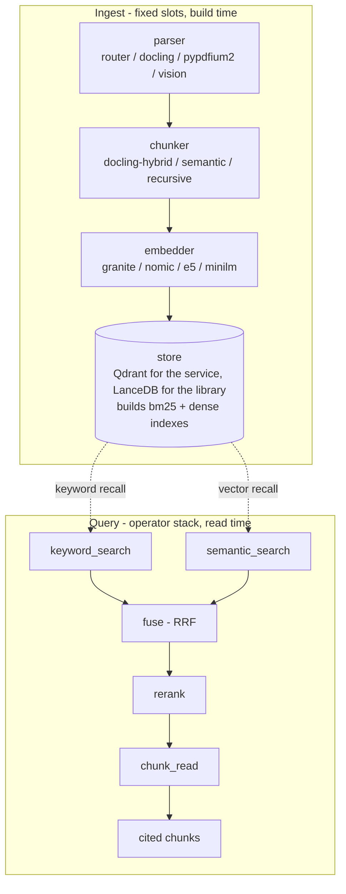

Every component carries metadata -- license, org, base-model lineage tier,
hardware class, install extra. The metadata powers `madosho components list` and
the component registry; it is informational, never a runtime gate. madosho
exists to compare ANY RAG component: origin and license labels are facts to
filter on, not gates -- core loads whatever component the user names.

## The web workbench

The backend is the product; the web UI is there to visualize the retrieval
process and organize documents (run it headless and you never touch the UI at
all). A few of its surfaces:

A single document carries any number of named pipelines, each independently
rated step by step - the comparison surface, front and center:

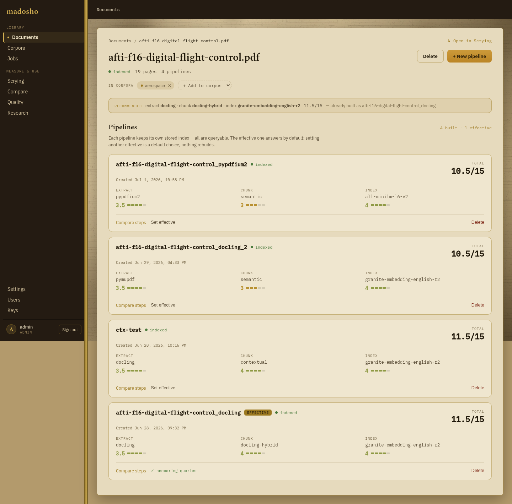

Line up what any two pipelines actually extracted, page by page, with every
disagreement highlighted - here a layout-aware parser (docling) against a plain
text-layer dump (pypdfium2) on the same page:

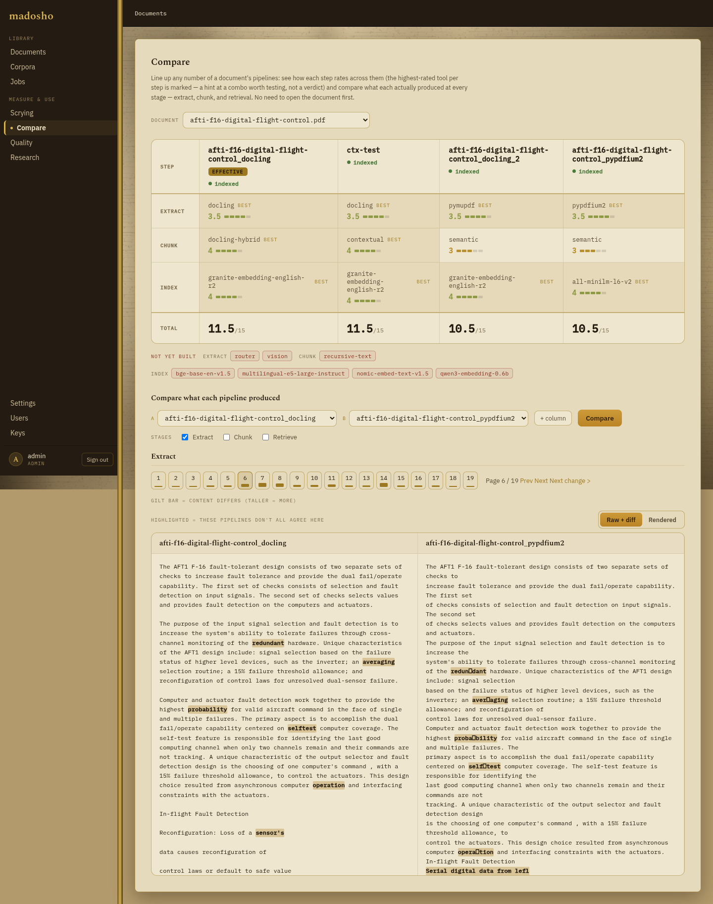

Ask a corpus a question and draw out a cited answer - or take just the passages
it surfaces and let your own agent finish:

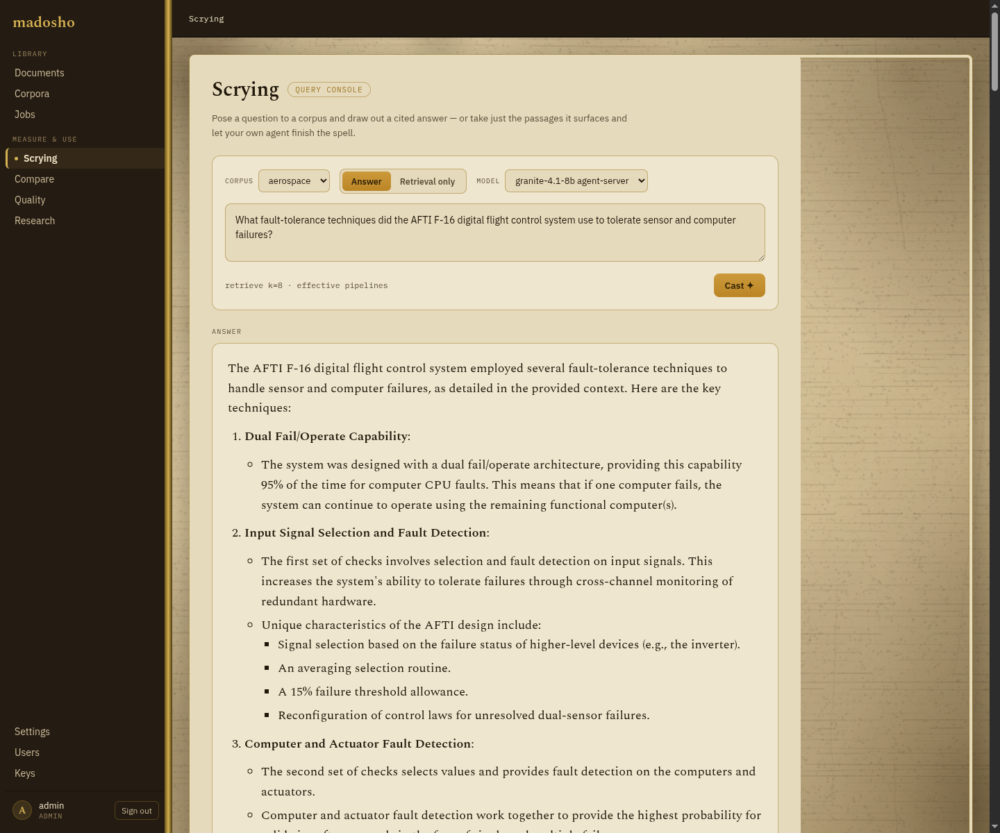

Or hand a harder, multi-part question to the research agent - it runs several
retrieval rounds and returns a cited report you can read or download:

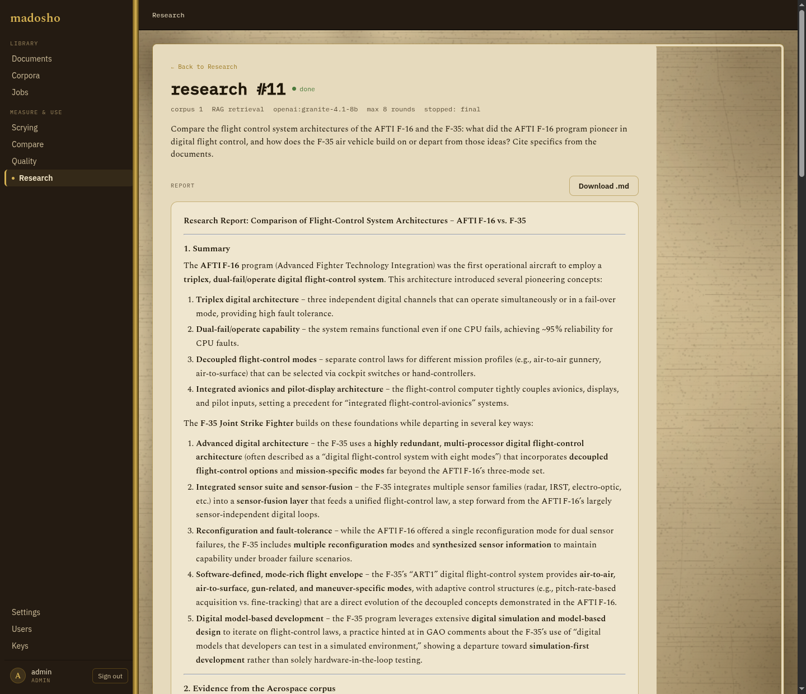

Every pipeline's build steps and each document's retrieval dimensions, scored
0-5, so you can see which recipe actually wins:

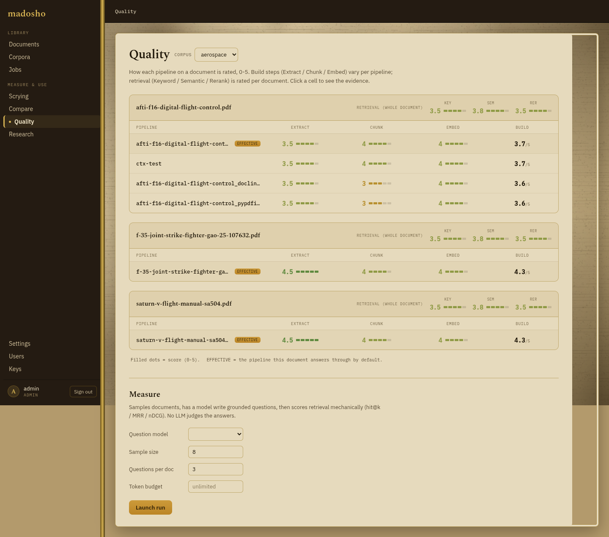

The document library - each source indexed once, then shared across any number
of corpora:

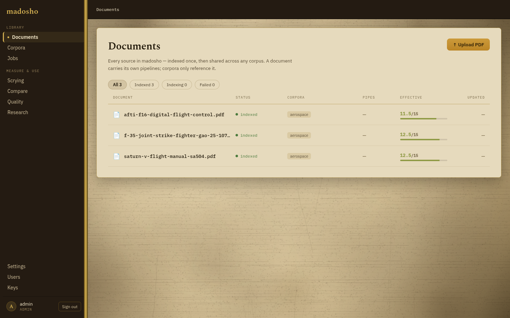

## Bundled components

Live output of `madosho components list` on a default install. Components from
installed bundles appear in the same table with their own origin and license
values -- see `docs/COMPLIANCE.md` for what the origin column means and what
ships by default versus in the opt-in bundles:

```text
kind      name                            license                     org                              origin      hardware  extra
parser    docling                         MIT                         IBM / LF AI & Data               us_src      cpu       docling
parser    pypdfium2                       Apache-2.0 OR BSD-3-Clause  pypdfium2-team                   us_src      cpu       docling
parser    router                          Apache-2.0                  madosho                          us_src      cpu       docling
parser    vision                          Apache-2.0                  madosho                          us_src      cpu       docling
chunker   contextual                      Apache-2.0                  madosho                          us_src      cpu       -
chunker   docling-hybrid                  MIT                         IBM / LF AI & Data               us_src      cpu       docling
chunker   recursive-text                  Apache-2.0                  madosho                          us_src      cpu       -
chunker   semantic                        Apache-2.0                  madosho                          us_src      cpu       -
embedder  all-minilm-l6-v2                Apache-2.0                  Sentence-Transformers (UKP Lab)  allied_src  cpu       models
embedder  granite-embedding-english-r2    Apache-2.0                  IBM                              us_src      cpu       models
embedder  multilingual-e5-large-instruct  MIT                         Microsoft                        us_src      cpu       models
embedder  nomic-embed-text-v1.5           Apache-2.0                  Nomic AI                         us_src      cpu       models
store     lancedb                         Apache-2.0                  LanceDB                          us_src      cpu       lancedb
store     qdrant                          Apache-2.0                  Qdrant                           allied_src  cpu       qdrant
reranker  granite-reranker-english-r2     Apache-2.0                  IBM                              us_src      cpu       models
reranker  ms-marco-minilm-l6-v2           Apache-2.0                  Sentence-Transformers (UKP Lab)  allied_src  cpu       models
reranker  mxbai-rerank-base-v1            Apache-2.0                  Mixedbread                       allied_src  cpu       models
operator  chunk_read                      Apache-2.0                  madosho                          us_src      cpu       -
operator  fuse                            Apache-2.0                  madosho                          us_src      cpu       -
operator  keyword_search                  Apache-2.0                  madosho                          us_src      cpu       -
operator  rerank                          Apache-2.0                  madosho                          us_src      cpu       -
operator  semantic_search                 Apache-2.0                  madosho                          us_src      cpu       -
```

An in-memory testing kit -- the `fake-*` components and `hash-embedder` --
ships so examples and tests run without heavy extras. It is hidden from this
list and the pipeline builder; `madosho components list --all` surfaces it.

The `router` parser routes PDFs between lanes: the structure lane (Docling
layout + TableFormer) is the default; `fast_lane: true`
opts text-layer PDFs into pypdfium2. The VLM lane for scanned documents is
handled by the vision server (`services/vision-server/`).

Scanned documents have two classical alternatives to the VLM lane: turn on
OCR in the docling lane with `parser: {docling: {ocr: true}}` (the `router`
parser takes the same options), and pick an engine with `ocr_engine` --
`tesseract` (default, in the image), `rapidocr` (in the image; model-origin
note in `docs/COMPLIANCE.md`), or `easyocr` (opt-in via the
`compose.ocr.yaml` overlay, CPU or GPU). With OCR on, the docling lane also
accepts bare images (png/jpg/tiff/...), so the same scan can be indexed
through an OCR pipeline and a vision pipeline and compared head to head.

## Writing your own component

Components implement small Protocols (`backend/madosho/core/protocols.py`) and ship
as separate pip packages, discovered through the `madosho.components`
entry-point group with `"<kind>.<name>"` entry names:

```toml
[project.entry-points."madosho.components"]
"parser.my-parser" = "my_package:MyParser"
```

Once installed, `parser: my-parser` works in any `madosho.yaml` -- no
registration step. `madosho.testing` ships in-memory fakes and the reusable
contract-test batteries the bundled adapters pass, so third-party adapters can
prove protocol compliance with a few lines of pytest. This is also the supported
home for adapters core cannot bundle (e.g., AGPL components like PyMuPDF --
core keeps its dependency tree free of copyleft).

There is also a resolution-hook seam (`madosho.hooks` entry-point group):
installed packages can observe or veto component resolution and emit audit
records -- policy lives in hooks a deployment installs, never in core.

## Component bundles (opt-in)

The components bundled in this repo are the **baseline**: US or allied origin,
permissively licensed. Two off-baseline bundles live as their own repositories
and plug in through the same `madosho.components` entry point -- install one and
its components appear in `madosho components list` and the pipeline builder,
each labeled honestly with its origin and license. Neither changes madosho's own
Apache-2.0 license or its dependency tree.

| Bundle | What it adds | Why it is a separate repo |
|--------|--------------|---------------------------|
| [`madosho-cn-oth-src`](https://github.com/hogu-dev/madosho-cn-oth-src) | CN-origin but permissively licensed models: BAAI `bge-*` and Alibaba `qwen3-embedding` (embedders + rerankers) | **Origin opt-out.** An operator whose policy excludes non-allied components simply does not install it, and the whole batch disappears from the menu at once. |
| [`madosho-allied-agpl`](https://github.com/hogu-dev/madosho-allied-agpl) | Copyleft parsers: PyMuPDF (AGPL-3.0), with Marker/Surya planned | **License isolation.** The copyleft imports live in a separate AGPL distribution, so the license never attaches to madosho's permissive core. Whoever installs the bundle assembles the combined work and takes on its obligations -- a deliberate, opt-in choice. |

Both install with `pip install -e .` into the madosho environment (usually the
worker). See each repo's README for details, and `docs/COMPLIANCE.md` for what
the origin column means and the full component taxonomy.

## Choosing a tool-calling model

madosho's research lane drives an agent that must emit native OpenAI `tool_calls`
every round. Any GGUF model that llama.cpp serves with `--jinja` (its own chat
template) can do this. The tables below gather what the internet reports for
locally-runnable open-weight models, split by origin so you can weigh the
provenance tradeoff. Read the notes before the numbers.

**How to read this:** every model listed calls tools natively under llama.cpp.
The scores come from the [Berkeley Function-Calling Leaderboard](https://gorilla.cs.berkeley.edu/leaderboard.html)
(BFCL), a tool-calling accuracy benchmark. **A blank score means the vendor has
not published a number -- not that the model is weak.** BFCL v3 (reported as a
percentage) and BFCL v4 (a 0-1 agentic score) use different scales and are not
comparable across those two columns. Most numbers come from secondary aggregators
or vendor self-reports, not a single neutral run on these exact GGUF quants, so
treat them as a rough guide, not a leaderboard. VRAM figures are approximate for a
~Q4 quant and count unified memory (GPU + system RAM) where a model is offloaded.

### Allied / Western models

| Model | Origin | Size (active) | ~VRAM Q4 | Tool-calls | BFCL v3 | BFCL v4 | Confidence |
|-------|--------|---------------|----------|------------|---------|---------|------------|
| Granite 4.1 30B | US (IBM) | 32B/9B MoE | ~19 GB | Yes | ~74% | -- | vendor-reported |
| Granite 4.1 8B | US (IBM) | 7B/1B MoE | ~6 GB | Yes | ~68% | -- | vendor-reported |
| Granite 4.1 3B | US (IBM) | 3B dense | ~3 GB | Yes | ~61% | -- | vendor-reported |
| gpt-oss-20B | US (OpenAI) | 20B MoE | ~14 GB | Yes* | not published | -- | gap |
| gpt-oss-120B | US (OpenAI) | 120B MoE | ~63 GB | Yes* | not published | -- | gap |
| Llama 4 Scout | US (Meta) | 109B/17B MoE | ~60 GB | Yes | 55.7% | -- | secondary |
| Nemotron-3 Nano 4B | US (NVIDIA) | 4B | ~4 GB | Yes | not published | -- | gap |
| Gemma 4 27B | US (Google) | 27B | ~16 GB | Yes | not published | -- | gap |
| Devstral-Small-2 24B | EU (Mistral) | 24B | ~14 GB | Yes | not published | -- | gap |
| Mistral Small 4 | EU (Mistral) | ~24B | ~14 GB | Yes | not published | -- | blog: ~72% |

Both Chinese-origin groups below install through the opt-in
[`madosho-cn-oth-src`](https://github.com/hogu-dev/madosho-cn-oth-src) bundle.

### Chinese-origin models -- locally runnable (single GPU)

These fit a single 8-24 GB GPU and are the practical CN picks for a desktop.

| Model | Origin | Size (active) | ~VRAM Q4 | Tool-calls | BFCL v3 | BFCL v4 | Confidence |
|-------|--------|---------------|----------|------------|---------|---------|------------|
| Qwen3.5-35B-A3B | CN | 35B/3B MoE | ~22 GB | Yes | -- | 0.673 | verified |
| Qwen3.5-27B | CN | 27B | ~18 GB | Yes | -- | 0.685 | verified |
| Qwen3 14B | CN | 14B | ~10 GB | Yes | not published | -- | gap |
| Qwen3.5-9B | CN | 9B | ~7 GB | Yes | -- | 0.661 | verified |
| Qwen3 8B (non-reasoning) | CN | 8B | ~6 GB | Yes | 67.3% | -- | verified |
| Qwen3 4B | CN | 4B | ~4 GB | Yes | ~40-62% (varies) | -- | low |

### Chinese-origin models -- server-class (very high VRAM)

These top the tool-calling benchmarks but are large MoE models that need
multi-GPU or dedicated server infrastructure -- not a single desktop GPU.

| Model | Origin | Size (active) | ~VRAM Q4 | Tool-calls | BFCL v3 | BFCL v4 | Confidence |
|-------|--------|---------------|----------|------------|---------|---------|------------|
| GLM-4.5 | CN | 355B MoE | very high | Yes | 76.7-77.8% | -- | verified (vendor) |
| Qwen3-Coder 480B | CN | 480B MoE | very high | Yes | 77.1% | -- | verified |
| Qwen3 235B (thinking) | CN | 235B/22B MoE | very high | Yes | 71.9% | -- | verified |
| Qwen3 235B (non-reasoning) | CN | 235B/22B MoE | very high | Yes | 63.9% | -- | verified |
| Kimi K2 | CN | ~1T MoE | very high | Yes | 71.1% | -- | verified |
| Kimi K2.6 | CN | 1T/32B MoE | 350-600 GB | Yes | not published | not published | gap |
| DeepSeek-R1 | CN | 671B MoE | very high | Yes | 63.8% | -- | verified |
| DeepSeek V3.2 Exp | CN | 671B MoE | very high | Yes | 57.6% | -- | verified |
| GLM-5 (non-reasoning) | CN | -- | very high | Yes | 60.4% | -- | verified |
| Qwen3.5-397B-A17B | CN | 397B/17B MoE | very high | Yes | -- | 0.729 | verified |
| Qwen3.5-122B-A10B | CN | 122B/10B MoE | ~70 GB | Yes | -- | 0.722 | verified |

`*` gpt-oss calls tools natively but has known multi-turn chat-template quirks in
llama.cpp (an assistant turn carrying both reasoning and `tool_calls` can throw a
template error); pin a current llama.cpp build if you hit it. The strongest scores
belong to very large MoE models (GLM-4.5, Qwen3-Coder, Kimi) that need far more
memory than most local setups have -- for a single 8-24 GB GPU the practical
picks are the smaller Granite, gpt-oss-20B, Qwen3, and Gemma 4 rows.

## Known limitations and open debts

**Kernel limitations (still accurate):**

- **No audio lane.** The `docling`/`router` parsers read PDF, office (docx,
  pptx, xlsx), web (html), markup/text (md, txt, asciidoc), csv, email (eml),
  epub, and latex -- plus bare images (png/jpg/tiff/...) when the `ocr` option
  is on (otherwise images route to the separate `vision` parser). Audio and
  other media are counted as `skipped` (no ASR lane).
- **No deletion/rename reconciliation.** Chunks of files deleted or renamed since
  the last ingest linger in the indexes. Workaround: delete `.madosho/` and
  re-ingest.
- **Query stacks need an explicit `fuse`.** Without a `fuse` step the hit list
  stays silently empty.
- **The full-text index is rebuilt once per process** on the first
  `keyword_search`.
- **The LanceDB store persists only the `source` chunk-metadata key.** Custom
  metadata from third-party chunkers is dropped on round-trip.
- **The `qdrant` store's BM25 keyword tokenization is ASCII/Latin-only.** CJK,
  Cyrillic, and other non-Latin scripts get no keyword recall.
- **The `qdrant` store's BM25 length normalization assumes a fixed average chunk
  length** (256 tokens) rather than live collection statistics.

**Service / eval open debts:**

- **Eval proposals are read-only recommendations.** An eval run scores recipe
  variations and proposes a winner; adopting it is the normal flow of building
  that recipe as a pipeline and marking it effective. There is no auto-apply.
- **Quality-page semantics are still settling.** The page works but its
  dimensions and labels need a rethink against real usage before they mean
  anything reliable.
- **Dead client method:** `setRatingsConfig()` exists in the API client but
  nothing in the UI calls it.

## Roadmap (high level)

- **Packaging:** PyPI releases for `madosho-cli` and `madosho-mcp` (uvx-able),
  plus a Claude Code plugin bundling the skills and MCP server, so agent users
  never need to clone this repo.
- **Cross-corpus search:** an agent tool that searches all corpora in one call
  (today's query plane requires picking one corpus or document).
- **Autonomous reporting and analysis** on top of the research agent -- the
  orchestration groundwork is laid; the output spec is the remaining piece.
- **HTTPS/TLS:** an opt-in Caddy overlay ships in `examples/tls/` (local-CA
  certificates for LAN setups, Let's Encrypt for public domains). Still to
  come: native TLS flags on the services themselves for proxy-free
  deployments.
- **Table-aware comparison diffs:** normalize table formatting before diffing
  extraction panes, so the change map reports content disagreements rather than
  markdown styling.
- **Least-privilege research jobs:** shrink the per-job research container down
  to a scoped API key + an LLM URL, with the worker writing results.
- **Transitive dependency audit:** a repeatable license/origin check across the
  full dependency tree, beyond today's direct-dependency guarantees.

## Development

```bash
python -m venv .venv
.venv/bin/pip install -e ".[local,qdrant,dev]"
.venv/bin/python -m pytest -q -m "not slow"   # fast suite (unit tests on in-memory fakes)
.venv/bin/python -m pytest -m slow -q         # integration: real models and IO (downloads models on first run)
```

## License

Apache-2.0. Dependency-license policy: no copyleft in core -- AGPL components
(like the PyMuPDF adapter) live as separate opt-in plugins that users install
themselves. Model weights are never bundled; they download at runtime into your
Hugging Face cache under each model's own license.
